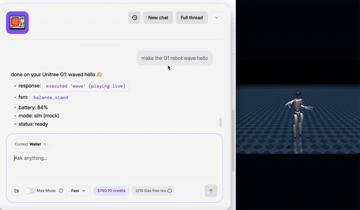

<div align="center">

# 🦾 Unitree Skill

### Talk to a humanoid robot on the timeline.

**Post a sentence. A real Unitree humanoid moves.**

<br/>

<a href="docs/media/bankr-g1-demo.mp4">
  
</a>

<sub><b>Live:</b> Bankr takes a natural-language command from the timeline and a Unitree humanoid executes it in real time. <a href="docs/media/bankr-g1-demo.mp4">▶ Watch the full clip</a></sub>

<br/>
<br/>

[](SKILL.md)
[](https://www.unitree.com)
[](#installing-the-skill-into-a-harness)
[](#safety-model-why-the-bridge-not-the-agent-decides)
[](SKILL.md)

</div>

---

## What this is

An **agent skill** that lets an autonomous agent drive a **real Unitree
humanoid** with plain language. Same playbook as the Teslr / Tesla skill —
pointed at a robot instead of a car:

```
real-world API (Unitree SDK)  →  MCP/CLI wrapper (this bridge)  →  SKILL.md (agent instructions)  →  bankr / claude code / kiro
```

The one architectural twist vs Tesla: **Tesla has a cloud API, Unitree does
not.** The robot speaks DDS on your LAN, so we run a small **bridge** next to the
robot and expose it through a tunnel. The agent (in the cloud) calls the tunnel
URL; **the bridge owns all safety.**

```
X timeline (bankr)  ──HTTPS + Bearer token──▶  tunnel (cloudflared/ngrok)
                                                   │
                                                   ▼
                                        bridge/server.py (FastAPI)
                                                   │  action whitelist + FSM gating
                                                   ▼
                                    unitree_sdk2py LocoClient ──DDS/LAN──▶ Unitree
```

## Why it matters

| | |
|---|---|
| 🗣️ **Natural language in** | "wave hello", "sit down", "shake hands" — no API knowledge needed. |
| 🤖 **Physical motion out** | An agent's on-chain / on-timeline intent becomes real-world movement. |
| 🔒 **Safety at the edge** | The agent can *ask*, but the bridge decides. Whitelist + state + battery gating. |
| 🧪 **Demo without hardware** | Three backends: mock, MuJoCo sim (mp4 / live window), and the real robot. |

---

## Layout

```
unitree-skill/
├── SKILL.md                 # the installable skill (agent instruction layer)
├── bridge/
│   ├── g1_controller.py     # SDK wrapper: whitelist + safety gating + 3 backends
│   ├── g1_sim_mujoco.py     # SIM backend: MuJoCo playback → mp4 (offline clips)
│   ├── g1_live.py           # LIVE viewer: persistent MuJoCo + MJPEG stream
│   ├── server.py            # FastAPI: /command /state /actions /health + /live + auth
│   └── __init__.py
├── scripts/smoke_test.sh    # end-to-end curl test
├── docs/media/              # demo clip, GIF, poster (the video above)
├── requirements.txt
└── .env.example
```

## Three backends (`G1_MODE`)

One switch, `G1_MODE`, picks the backend. The agent command and safety gating
are identical across all three — only the effect differs:

| `G1_MODE` | Needs | What happens | Use for |
|-----------|-------|--------------|---------|
| `mock` (default) | nothing | returns text, advances a fake FSM | wiring the timeline→bridge path |
| `sim` | MuJoCo | renders the gesture to an **mp4** you can post, or a **live window** | demo videos, no robot yet |
| `real` | `unitree_sdk2py` + Unitree on LAN | drives the physical robot | the live robot |

The legacy `G1_MOCK=1` still works and maps to `mock`.

---

## Quick start (no robot needed — MOCK mode)

```bash
cd unitree-skill
python -m venv .venv && source .venv/bin/activate
pip install -r requirements.txt

export BRIDGE_TOKEN=$(openssl rand -hex 24)
export G1_MOCK=1
uvicorn bridge.server:app --host 0.0.0.0 --port 8080
```

In another shell:

```bash
BRIDGE_URL=http://localhost:8080 BRIDGE_TOKEN=$BRIDGE_TOKEN \
  ./scripts/smoke_test.sh
```

You should see `wave` succeed, the dangerous action return **422**, and a bad
token return **401**. That is the full timeline→bridge→robot path, minus the
robot.

## Live demo window — type on the left, robot moves on the right

This is the one you screen-record (it's what the clip above shows). Start the
bridge, open `/live`, and you get a split window: **left = a text box + gesture
buttons, right = the robot moving in real time.** Type "wave hello" (or
"sit down" / "shake hands"), hit Send, and the robot on the right does it *now*. No file
is produced — you just record the window.

```bash
# one-time: install the sim extras
pip install mujoco 'imageio[ffmpeg]' pillow numpy

# start the bridge, then open http://localhost:8080/live in a browser
export BRIDGE_TOKEN=$(openssl rand -hex 24)
G1_MODE=sim uvicorn bridge.server:app --host 0.0.0.0 --port 8080
```

How it fits the timeline story: `/live/say` runs the **same** natural-language →
whitelisted-gesture path the agent uses, so when bankr later drives it, the
robot in this same window moves. Left box = "you or bankr typing"; right pane =
"the robot". Endpoints:

| Endpoint | What it does |
|----------|--------------|
| `GET /live` | the split window (no auth, just open it) |
| `GET /live/stream` | MJPEG stream of the live robot (the right pane) |
| `POST /live/say {"text": "..."}` | NL → gesture, plays it immediately |
| `GET /live/actions` | the gesture buttons |

Under the hood `g1_live.py` keeps **one** MuJoCo Unitree model alive in a background thread
(single-threaded GL context), interpolates each queued gesture into frames using
the exact same easing/gesture library as the mp4 backend, and hands the latest
JPEG to the browser. Same "no physics, can't fall over, no-locomotion gestures
only" rules as below.

## Making an mp4 clip instead (SIM mode)

If you want a **file** rather than a live window, `sim` also renders each gesture
with MuJoCo — a physics sandbox, **not** a Unity-style
editor: you feed it joint targets and it renders the frames. We use pure
kinematic playback (interpolate joint targets → `mj_forward` → offscreen render),
so the robot never needs a balance/walking policy and can't fall over. That means
**only "no-locomotion" gestures render** (e.g. `wave`); actions that need a
walking controller (`walk_forward`, `turn`) succeed the gate but report "no sim
animation".

```bash
# one-time: install the sim extras
pip install mujoco imageio 'imageio[ffmpeg]' numpy

# render a single gesture straight to mp4
G1_MODE=sim python -m bridge.g1_sim_mujoco wave
# → sim_out/g1_wave.mp4

# or through the full bridge (same command path the agent uses)
export BRIDGE_TOKEN=$(openssl rand -hex 24)
G1_MODE=sim uvicorn bridge.server:app --host 0.0.0.0 --port 8080
# a successful /command response now carries a "video" field with the mp4 path
```

Notes / gotchas:
- The Unitree MJCF model is reused from `unitree_lerobot` — no `mujoco_menagerie`
  download needed. Point `G1_SIM_MODEL` at a different XML to override.
- We render **offscreen** (`mujoco.Renderer`) on purpose: the interactive viewer
  needs `mjpython` on macOS, offscreen doesn't, and it produces the mp4 directly.

## Going live on the real robot

1. Run the bridge on a machine on the **same LAN / DDS domain** as the robot
   (Jetson, mini-PC, or a laptop plugged into the robot's network).
2. Install the SDK there: `pip install unitree_sdk2py`
   (or from source: https://github.com/unitreerobotics/unitree_sdk2_python).
3. Set `G1_MOCK=0` and `G1_NET_IFACE=<iface on the robot LAN>`.
4. **Expose it** (this is the "remote" part):
   ```bash
   # cloudflared (recommended, stable-ish URL with a named tunnel)
   cloudflared tunnel --url http://localhost:8080
   # or ngrok for a quick demo
   ngrok http 8080
   ```
5. The tunnel prints a public `https://…` URL → that is your `BRIDGE_URL`.

## Installing the skill into a harness

Point the harness at this repo's `SKILL.md` (e.g. `install_skill <github-url>`),
then paste two values when asked — exactly the Teslr "paste your key" flow:

- `BRIDGE_URL`  = the tunnel URL
- `BRIDGE_TOKEN` = the token you generated

Now on the timeline: **"@yourbot wave hello on my Unitree"** → the robot waves.

---

## Safety model (why the bridge, not the agent, decides)

- **Whitelist**: only named actions in `g1_controller.py` can ever run.
- **FSM gating**: motion is refused unless the robot is in `balance_stand`;
  a humanoid that walks from the wrong state falls over.
- **Battery gating**: walking/turning refused below 30%.
- **Dangerous actions** (`zero_torque`) require explicit `confirm:true`.
- **Rate limit**: motion commands are throttled to protect the hardware.
- **Fail closed**: no `BRIDGE_TOKEN` set ⇒ every request is rejected.

## Roadmap (next, once the loop is proven)

- **x402 paid endpoint**: wrap `/command` so other agents pay USDC per action.
- **On-chain triggers**: bridge subscribes to chain events (tip received / mint
  / gas threshold) and fires an action — the thing a pure MCP skill can't do.
- More expressive actions (dances / gestures) as the Unitree firmware exposes them.

---

<div align="center">
<sub>Built as an agent skill · MIT licensed · from on-chain intent to real-world motion 🦾</sub>
</div>
